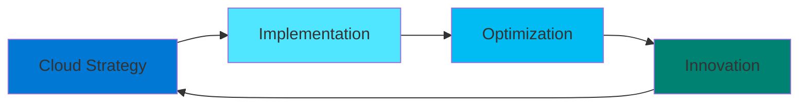

# 🚀 CloudBoostUP

### **Accelerating Digital Transformation Through Cloud Excellence**

[🌐 Website](https://cloudboostup.com) • [💼 LinkedIn](#) • [📧 Contact Us](#)

---

## 👋 Welcome to CloudBoostUP

We are a leading cloud transformation partner specializing in **Azure DevOps**, **Cloud Infrastructure**, and **AI-Powered Automation**. Our mission is to empower organizations to maximize their cloud potential through innovative solutions, best practices, and cutting-edge technology.

### 🎯 What We Do

- **☁️ Cloud Migration & Optimization** - Seamlessly transition to Azure with minimal disruption
- **🔄 DevOps Transformation** - Implement CI/CD pipelines and automation workflows
- **🤖 AI Agent Solutions** - Leverage AI to automate backlog management and development workflows
- **🛡️ Cloud Security & Compliance** - Ensure your infrastructure meets industry standards
- **📊 Infrastructure as Code** - Terraform, ARM, and Bicep implementations
- **🎓 Training & Consulting** - Upskill your teams with hands-on Azure and DevOps training

## 🌟 Featured Projects

Explore our open-source tools and frameworks designed to accelerate your cloud journey:

- **AI Agent Backlog Driver** - Intelligent backlog management powered by AI
- **Azure DevOps Automation Suite** - Pre-built templates and scripts for Azure DevOps
- **Cloud Architecture Patterns** - Reference architectures and best practices
- **Infrastructure Templates** - Production-ready IaC templates

## 💡 Our Expertise

### Technologies We Master

## 🤝 Why Choose CloudBoostUP?

| 🎯 **Proven Expertise** | 🚀 **Rapid Delivery** | 💎 **Quality First** |
|---|---|---|
| Years of cloud transformation experience | Agile methodologies for faster time-to-market | Best practices and industry standards |
| **🔒 Security Focused** | **📈 Scalable Solutions** | **🌍 Global Reach** |
| Enterprise-grade security implementations | Built to grow with your business | Supporting clients worldwide |

## 📚 Resources & Learning

- 📖 [Documentation](https://cloudboostup.com/docs) - Comprehensive guides and tutorials
- 🎥 [Video Tutorials](https://cloudboostup.com/videos) - Learn from our experts
- 📝 [Blog](https://cloudboostup.com/blog) - Latest insights and best practices
- 🎤 [Webinars](https://cloudboostup.com/webinars) - Live sessions and workshops

## 🌈 Contributing

We believe in the power of open-source! Check out our repositories and feel free to:

- ⭐ Star projects you find useful
- 🐛 Report issues or suggest improvements
- 🔀 Submit pull requests
- 💬 Join discussions and share your experience

See our [Contributing Guidelines](https://github.com/CloudBoostUP/.github/blob/main/CONTRIBUTING.md) to get started.

## 📞 Get In Touch

Ready to boost your cloud journey? Let's talk!

- 🌐 **Website:** [cloudboostup.com](https://cloudboostup.com)
- 📧 **Email:** info@cloudboostup.com
- 💼 **LinkedIn:** [Follow us](https://linkedin.com/company/cloudboostup)
- 🐦 **Twitter:** [@CloudBoostUP](https://twitter.com/cloudboostup)

---

**⚡ Transforming Businesses Through Cloud Innovation ⚡**

Made with ❤️ by CloudBoostUP Team

